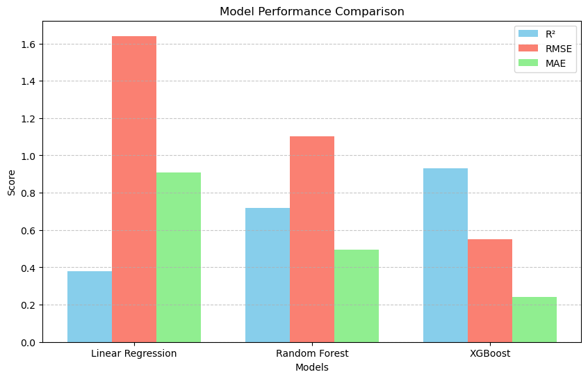

# Kenya Regional Crop Yield Prediction Using Machine Learning

## 📌 Project Overview
Agriculture is a critical sector in Kenya, supporting food security, employment, and economic stability. However, crop yields are highly sensitive to climate variability, regional differences, and agricultural input usage.

This project develops a machine learning pipeline to predict regional crop yields using historical production data, climate indicators, and pesticide usage. The goal is to provide data-driven insights that can support early warning systems, resource allocation, and agricultural planning.

---

## 🎯 Problem Statement
Traditional yield estimation relies on historical averages, limiting the ability to anticipate food shortages and climate-related production risks.

This project addresses the question:

> **How accurately can regional crop yields in Kenya be predicted using climate variables and agricultural input data?**

---

## 🧭 Objectives

- Predict crop yield at the regional level using supervised machine learning.
- Identify regions most sensitive to rainfall and temperature variability.
- Evaluate the influence of pesticide usage on yield outcomes.
- Explore whether predictive models can provide early warning signals for potential food shortages.

---

## 🗂️ Data Sources

### 1. Kenya Agricultural Production Dataset
- **Source:** Kaggle  
- **File:** `Kenya Agricultural production.xlsx`  
- **Variables:** Year, Crop, Area Harvested, Production, Yield  
- **Purpose:** Historical crop production metrics.

### 2. HarvestStat Africa – Regional Crop Data
- **Source:** HarvestStat GitHub  
- **File:** `adm_crop_production_KE.csv`  
- **Variables:** Region, Crop, Area, Production  
- **Purpose:** Regional yield modeling.

### 3. Climate Data (Rainfall & Temperature)
- **Source:** OpenAfrica  
- **Variables:** Year, Month, Rainfall (mm), Temperature (°C)  
- **Purpose:** Environmental drivers of yield variability.

### 4. Pesticide Usage Data
- **Source:** KAPSARC Data Portal  
- **Variables:** Year, Pesticide use per cropland area  
- **Purpose:** Proxy for agricultural input intensity.

---

## 🧹 Data Preparation

Key preprocessing steps:

- Filtered major Kenyan crops: maize, wheat, tea, sugarcane, rice, and sorghum.
- Pivoted production data to obtain area, production, and yield metrics.
- Created seasonal climate features (Long rains, Short rains, Annual).
- Aligned datasets by **Year, Region, Crop, and Season**.
- Imputed missing climate values using seasonal averages.
- Interpolated pesticide data for continuous yearly coverage.
- Standardized units for consistency across datasets.

---

## 🔍 Exploratory Data Analysis

Key findings:

- Yield distributions are right-skewed, indicating extreme values in high-production regions.
- Rainfall shows moderate positive correlation with yield in most regions.
- Temperature variability is limited, suggesting rainfall and management practices are stronger predictors.
- Maize dominates the dataset, which may influence model bias.

---

## 🤖 Modeling Approach

### Models Implemented
- Linear Regression (baseline)
- Random Forest Regressor
- XGBoost Regressor

### Why These Models?
- Linear Regression: baseline for linear relationships.
- Random Forest: captures nonlinear interactions and feature importance.
- XGBoost: handles complex patterns and improves predictive accuracy.

### Features Used
- Region
- Crop
- Season
- Rainfall
- Temperature
- Pesticide usage

### Target Variable
- Regional crop yield

---

## 📊 Evaluation Metrics

Models were evaluated using:

- Mean Absolute Error (MAE)
- Root Mean Squared Error (RMSE)
- R² Score

# Models Performance Comparision plot

---

## 📈 Key Insights

- Rainfall is a stronger predictor of yield than temperature.
- Yield response to rainfall is nonlinear, with diminishing returns beyond optimal levels.
- Some regions show weak climate-yield correlations, suggesting irrigation or adaptive practices.
- Ensemble models outperform linear regression, indicating complex interactions among variables.

---

## 🚀 Future Improvements

- Incorporate satellite-derived vegetation indices (NDVI).
- Use rainfall anomalies instead of raw rainfall totals.
- Implement time-aware validation for forecasting scenarios.

---

## 🛠️ Tech Stack

- **Python:** pandas, numpy, scikit-learn, XGBoost
- **Visualization:** matplotlib, seaborn
- **Deployment (planned):** Streamlit

---

## ⚠️ Limitations

- Climate data coverage ends in 2016; later years required imputation.
- Pesticide data is national-level and may not reflect regional variation.
- Limited temperature variability may reduce its predictive power.

---

## 📌 Conclusion

This project demonstrates the feasibility of predicting regional crop yields in Kenya using machine learning and multi-source agricultural data. The results highlight the importance of rainfall and regional variability, providing a foundation for future work in agricultural forecasting and decision support systems.

